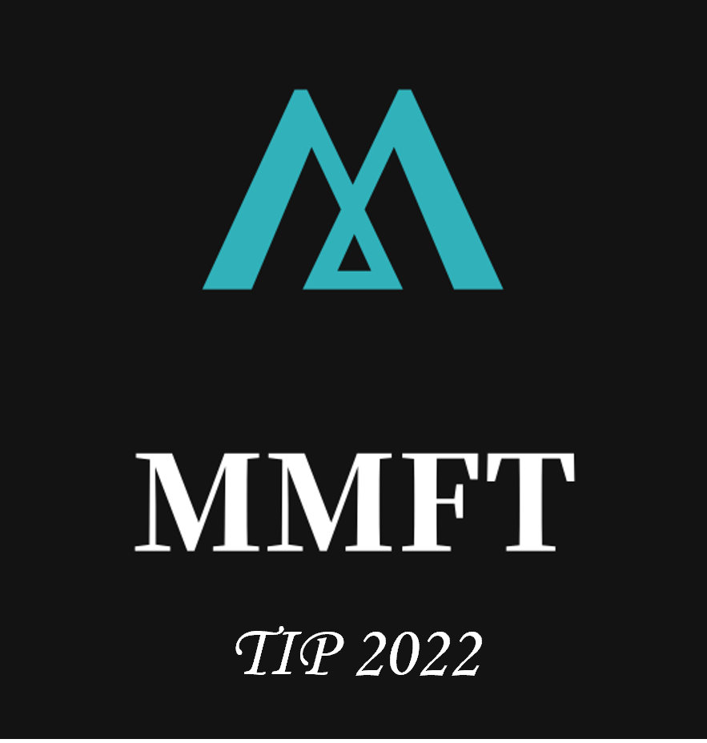

# MMFT

  

  <h3 align="center">Joint Learning of Salient Object Detection, Depth Estimation and Contour Extraction</h3>

    Xiaoqi Zhao, Youwei Pang, Lihe Zhang, Huchuan Lu
  

The official repo of the IEEE TIP 2022 paper, Joint Learning of Salient Object Detection, Depth Estimation and Contour Extraction.
