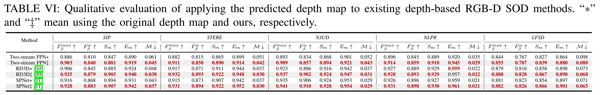

# MMFT
<br />
<p align="center">
  
  
<p align="center">
  <h1 align="center">Joint Learning of Salient Object Detection, Depth Estimation and Contour Extraction</h1>
  <p align="center">
    IEEE TIP, 2022
    <br />
    <a href="https://xiaoqi-zhao-dlut.github.io/"><strong>Xiaoqi Zhao</strong></a>
    ·
    <a href="https://lartpang.github.io/"><strong>Youwei Pang</strong></a>
    ·
    <a href="https://scholar.google.com/citations?hl=zh-CN&user=XGPdQbIAAAAJ"><strong>Lihe Zhang</strong></a>
    ·
    <a href="https://scholar.google.com/citations?hl=zh-CN&user=D3nE0agAAAAJ"><strong>Huchuan Lu</strong></a>
  </p>

  <p align="center">
    <a href='https://arxiv.org/pdf/2203.04895v2'>
      
    </a>
  </p>
<br />


## Motivation - Our High-quality Depth Prediction vs. Previous Low-quality Depth Inputs
<p align="center">
     <br />
</p>

## Motivation - Depth-free Networks
<p align="center">
     <br />
</p>

## Pipeline - Multi-task Learning Framework (Depth, Saliency, Contour)
<p align="center">
     <br />
</p>

## Potential - Predicted Depth Maps on RGB SOD datasets
<p align="center">
     <br />
</p>

## Potential - Helping Existing Depth-based Methods to Obtain Additional Gains
<p align="center">
     <br />
</p>

## Datasets
* [Google Drive](https://drive.google.com/file/d/1Nxm8wr2jSW-Ntqu8cdm4GfZPVOClJbZE/view?usp=sharing) / [BaiduYunPan(1a4t)](https://pan.baidu.com/s/1DUHzxs4JP4hzWJIoz4Lqyg)  

## Trained Models
-  MMFT_RES101_duts_njud_nlpr_jointT [GitHub Release](https://github.com/Xiaoqi-Zhao-DLUT/MMFT/releases/download/v1.0/MMFT_RES101_duts_njud_nlpr_jointT.pth)
-  MMFT_RES101_finetune_njud_nlpr [GitHub Release](https://github.com/Xiaoqi-Zhao-DLUT/MMFT/releases/download/v1.0/MMFT_RES101_finetune_njud_nlpr.pth)
-  MMFT_RES250_finetune_njud_nlpr [GitHub Release](https://github.com/Xiaoqi-Zhao-DLUT/MMFT/releases/download/v1.0/MMFT_RES250_finetune_njud_nlpr.pth)
-  MMFT_RES50_duts_njud_nlpr_jointT [GitHub Release](https://github.com/Xiaoqi-Zhao-DLUT/MMFT/releases/download/v1.0/MMFT_RES50_duts_njud_nlpr_jointT.pth)

## Prediction Maps
-  Depth_prediction [GitHub Release](https://github.com/Xiaoqi-Zhao-DLUT/MMFT/releases/download/v1.0/Depth_prediction.zip)
-  Saliency_prediction [GitHub Release](https://github.com/Xiaoqi-Zhao-DLUT/MMFT/releases/download/v1.0/Saliency_prediction.zip)

## Citation

If you think MMFT codebase are useful for your research, please consider referring us:

```bibtex
@article{MMFT,
  title={Joint learning of salient object detection, depth estimation and contour extraction},
  author={Zhao, Xiaoqi and Pang, Youwei and Zhang, Lihe and Lu, Huchuan},
  journal={IEEE Transactions on Image Processing},
  volume={31},
  pages={7350--7362},
  year={2022}
}
```

